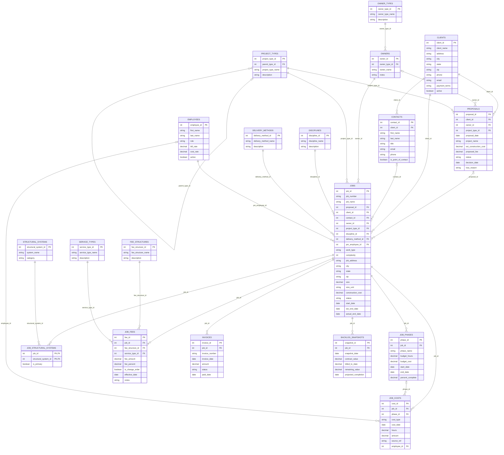

# ARLO — Product & Data Model Spec

> Working spec for ARLO, a job setup, project tracking, backlog, and fee development platform for engineering firms.
> Source: `ARLO_Data_Model.xlsx`. Status: draft v0.2.

## 1. Problem

Engineering firms set up jobs inconsistently, track project data in scattered places, and price new work from memory. That makes it hard to:

- Project backlog (remaining contracted work over time)
- Price new proposals using what similar past jobs actually charged and cost
- See how fees vary by client, owner type, project type, discipline, delivery method, and structural system

## 2. Product concept

ARLO is **one platform built on a single job record**. Every module reads from or writes to the same data, so information is entered once.

| Module | What it does | Reads / writes |
|---|---|---|
| Job setup | Guided intake that creates the job number and captures every attribute used later | Writes `jobs`, `job_fees`, `job_phases`, `job_structural_systems` |
| Fee development | Shows fee ranges for similar past jobs and recommends a fee | Reads `job_fees`, `jobs`, `proposals`, lookups |
| Backlog projection | Remaining contract value on active jobs, spread over time, with monthly history | Reads `job_fees`, `invoices`, `job_phases`; writes `backlog_snapshots` |
| Estimating | Hours and cost by phase and role on comparable closed jobs | Reads `job_costs`, `job_phases`, `jobs` |

AI agents sit on top of these modules (for example: "set up a job from this email", "what should we charge for this", "what does Q3 backlog look like") and use the same data.

### Target user

Engineering firms first (structural, civil, MEP, geotechnical). Fees are mostly hourly, lump sum by phase, or percent of construction cost, so **hours by phase and role** are the key estimating data.

## 3. Design principles

1. **One job record is the source of truth.** No module keeps its own copy of job data.
2. **Structured fields over free text** at job setup (dropdowns from lookup tables) so data can be grouped and compared.
3. **Only capture what changes pricing.** If the firm wouldn't price a job differently because of a field, leave it out.
4. **Integrate, don't duplicate.** Pull actual costs and billings from the firm's accounting / time-tracking system where possible.
5. **`job_id` never changes; `job_number` is the firm's format** and can change without breaking links.

## 4. Build order

1. Job setup (clean data capture)
2. Fee tracking and fee lookup
3. Backlog projection
4. Estimating comps and AI recommendations (needs 1–2 years of closed jobs)

## 5. Data model

Table categories: **Core** (main business entities), **Activity** (things that happen on jobs), **Lookup** (dropdown values).

### 5.1 Entity relationship diagram

Lines run from the parent (one) to the child (many). `||` = required, `|o` = optional.

### 5.2 Tables

Key: **PK** = primary key, **FK** = foreign key, **PK, FK** = part of a composite key.

#### `clients` — Clients
*Core table.* Who hires you / pays the invoices.

| Column | Display name | Key | Type | References | Required | Notes |
|---|---|---|---|---|---|---|
| `client_id` | Client ID | PK | Integer |  | Yes | Unique ID for each client |
| `client_name` | Client Name |  | Text |  | Yes | Legal or common name |
| `address` | Address |  | Text |  | Yes | Street address |
| `city` | City |  | Text |  | Yes | City |
| `state` | State |  | Text |  | Yes | 2-letter state |
| `zip` | Zip |  | Text |  | Yes | Zip code (stored as text to keep leading zeros) |
| `phone` | Phone |  | Text |  | No | Main office phone |
| `email` | Email |  | Text |  | No | General / billing email |
| `payment_terms` | Payment Terms |  | Text |  | No | e.g. Net 30 |
| `active` | Active |  | Yes/No |  | Yes | Still an active client? |

#### `contacts` — Contacts
*Core table.* People at each client (replaces the single Point of Contact field).

| Column | Display name | Key | Type | References | Required | Notes |
|---|---|---|---|---|---|---|
| `contact_id` | Contact ID | PK | Integer |  | Yes | Unique ID for each contact |
| `client_id` | Client ID | FK | Integer | `clients.client_id` | Yes | Which client this person works for |
| `first_name` | First Name |  | Text |  | Yes |  |
| `last_name` | Last Name |  | Text |  | Yes |  |
| `title` | Title |  | Text |  | No | Job title |
| `email` | Email |  | Text |  | No |  |
| `phone` | Phone |  | Text |  | No |  |
| `is_point_of_contact` | Is Point of Contact |  | Yes/No |  | Yes | Primary contact for the client |

#### `owner_types` — Owner Types
*Lookup table.* Categories of project owner.

| Column | Display name | Key | Type | References | Required | Notes |
|---|---|---|---|---|---|---|
| `owner_type_id` | Owner Type ID | PK | Integer |  | Yes | Unique ID |
| `owner_type_name` | Owner Type Name |  | Text |  | Yes | Public, Private, Developer, Institutional, etc. |
| `description` | Description |  | Text |  | No |  |

#### `owners` — Owners
*Core table.* The project owner (may differ from the client who pays you).

| Column | Display name | Key | Type | References | Required | Notes |
|---|---|---|---|---|---|---|
| `owner_id` | Owner ID | PK | Integer |  | Yes | Unique ID for each owner |
| `owner_type_id` | Owner Type ID | FK | Integer | `owner_types.owner_type_id` | Yes | Public, private, etc. |
| `owner_name` | Owner Name |  | Text |  | Yes |  |
| `notes` | Notes |  | Text |  | No |  |

#### `project_types` — Project Types
*Lookup table.* Kinds of projects; supports subtypes.

| Column | Display name | Key | Type | References | Required | Notes |
|---|---|---|---|---|---|---|
| `project_type_id` | Project Type ID | PK | Integer |  | Yes | Unique ID |
| `parent_type_id` | Parent Type ID | FK | Integer | `project_types.project_type_id` | No | Blank for top level; otherwise the parent type (e.g. K-12 under Education) |
| `project_type_name` | Project Type Name |  | Text |  | Yes |  |
| `description` | Description |  | Text |  | No |  |

#### `disciplines` — Disciplines
*Lookup table.* Engineering discipline of the work.

| Column | Display name | Key | Type | References | Required | Notes |
|---|---|---|---|---|---|---|
| `discipline_id` | Discipline ID | PK | Integer |  | Yes | Unique ID |
| `discipline_name` | Discipline Name |  | Text |  | Yes | Structural, Civil, MEP, Geotechnical, Survey, etc. |
| `description` | Description |  | Text |  | No |  |

#### `delivery_methods` — Delivery Methods
*Lookup table.* How the project is being delivered.

| Column | Display name | Key | Type | References | Required | Notes |
|---|---|---|---|---|---|---|
| `delivery_method_id` | Delivery Method ID | PK | Integer |  | Yes | Unique ID |
| `delivery_method_name` | Delivery Method Name |  | Text |  | Yes | Design-Bid-Build, Design-Build, CM at Risk, IPD, Unknown |
| `description` | Description |  | Text |  | No |  |

#### `proposals` — Proposals
*Activity table.* Every bid or fee proposal, won or lost.

| Column | Display name | Key | Type | References | Required | Notes |
|---|---|---|---|---|---|---|
| `proposal_id` | Proposal ID | PK | Integer |  | Yes | Unique ID |
| `client_id` | Client ID | FK | Integer | `clients.client_id` | Yes | Who the proposal went to |
| `owner_id` | Owner ID | FK | Integer | `owners.owner_id` | No | Project owner, if known |
| `project_type_id` | Project Type ID | FK | Integer | `project_types.project_type_id` | Yes |  |
| `proposal_date` | Proposal Date |  | Date |  | Yes | Date submitted |
| `project_name` | Project Name |  | Text |  | Yes |  |
| `est_construction_cost` | Est Construction Cost |  | Currency |  | No | Owner's construction budget |
| `proposed_fee` | Proposed Fee |  | Currency |  | Yes | Total fee proposed |
| `status` | Status |  | Text |  | Yes | Pending, Won, Lost, Withdrawn |
| `decision_date` | Decision Date |  | Date |  | No |  |
| `loss_reason` | Loss Reason |  | Text |  | No | Price, schedule, relationship, etc. |

#### `employees` — Employees
*Core table.* Your staff (project managers and anyone who logs costs).

| Column | Display name | Key | Type | References | Required | Notes |
|---|---|---|---|---|---|---|
| `employee_id` | Employee ID | PK | Integer |  | Yes | Unique ID |
| `first_name` | First Name |  | Text |  | Yes |  |
| `last_name` | Last Name |  | Text |  | Yes |  |
| `role` | Role |  | Text |  | Yes | PM, Engineer, Drafter, etc. |
| `bill_rate` | Bill Rate |  | Currency |  | No | Hourly rate charged to clients |
| `cost_rate` | Cost Rate |  | Currency |  | No | Hourly cost to the firm |
| `active` | Active |  | Yes/No |  | Yes |  |

#### `jobs` — Jobs
*Core table.* The job record — the center of ARLO.

| Column | Display name | Key | Type | References | Required | Notes |
|---|---|---|---|---|---|---|
| `job_id` | Job ID | PK | Integer |  | Yes | Internal unique ID (never changes) |
| `job_number` | Job Number |  | Text |  | Yes | Your job number format, unique |
| `job_name` | Job Name |  | Text |  | Yes |  |
| `proposal_id` | Proposal ID | FK | Integer | `proposals.proposal_id` | No | The proposal this job came from |
| `client_id` | Client ID | FK | Integer | `clients.client_id` | Yes | Who you bill |
| `contact_id` | Contact ID | FK | Integer | `contacts.contact_id` | No | Point of contact for this job |
| `owner_id` | Owner ID | FK | Integer | `owners.owner_id` | Yes | Project owner |
| `project_type_id` | Project Type ID | FK | Integer | `project_types.project_type_id` | Yes |  |
| `discipline_id` | Discipline ID | FK | Integer | `disciplines.discipline_id` | Yes | Structural, civil, MEP, etc. |
| `delivery_method_id` | Delivery Method ID | FK | Integer | `delivery_methods.delivery_method_id` | Yes | Design-bid-build, design-build, etc. |
| `pm_employee_id` | PM Employee ID | FK | Integer | `employees.employee_id` | Yes | Your project manager |
| `work_type` | Work Type |  | Text |  | Yes | New Construction, Renovation, Addition, Assessment |
| `complexity` | Complexity |  | Integer |  | Yes | PM's rating at setup: 1 = simple, 5 = very complex |
| `job_address` | Job Address |  | Text |  | Yes | Street address of the project site |
| `city` | City |  | Text |  | Yes |  |
| `state` | State |  | Text |  | Yes |  |
| `zip` | Zip |  | Text |  | Yes |  |
| `size` | Size |  | Decimal |  | No | Size measure used for fee/cost per unit |
| `size_unit` | Size Unit |  | Text |  | No | SF, stories, linear ft, etc. |
| `construction_cost` | Construction Cost |  | Currency |  | No | Construction value of the project |
| `status` | Status |  | Text |  | Yes | Active, On Hold, Complete, Cancelled |
| `start_date` | Start Date |  | Date |  | Yes |  |
| `est_end_date` | Est End Date |  | Date |  | Yes | Used for backlog timing |
| `actual_end_date` | Actual End Date |  | Date |  | No |  |

#### `job_phases` — Job Phases
*Activity table.* Phases / milestones within a job, with budgets.

| Column | Display name | Key | Type | References | Required | Notes |
|---|---|---|---|---|---|---|
| `phase_id` | Phase ID | PK | Integer |  | Yes | Unique ID |
| `job_id` | Job ID | FK | Integer | `jobs.job_id` | Yes |  |
| `phase_name` | Phase Name |  | Text |  | Yes | SD, DD, CD, CA, etc. |
| `budget_hours` | Budget Hours |  | Decimal |  | No |  |
| `budget_cost` | Budget Cost |  | Currency |  | No |  |
| `start_date` | Start Date |  | Date |  | No |  |
| `end_date` | End Date |  | Date |  | No |  |
| `percent_complete` | Percent Complete |  | Percent |  | No | Entered as a fraction (0.4 = 40%) |

#### `job_costs` — Job Costs
*Activity table.* Actual hours and costs charged to a job.

| Column | Display name | Key | Type | References | Required | Notes |
|---|---|---|---|---|---|---|
| `cost_id` | Cost ID | PK | Integer |  | Yes | Unique ID |
| `job_id` | Job ID | FK | Integer | `jobs.job_id` | Yes |  |
| `phase_id` | Phase ID | FK | Integer | `job_phases.phase_id` | No | Phase the cost belongs to |
| `cost_type` | Cost Type |  | Text |  | Yes | Labor, Subconsultant, Reimbursable Expense |
| `cost_date` | Cost Date |  | Date |  | Yes |  |
| `hours` | Hours |  | Decimal |  | No | Labor only |
| `amount` | Amount |  | Currency |  | Yes |  |
| `source_ref` | Source Ref |  | Text |  | No | Timesheet or accounting system reference |
| `employee_id` | Employee ID | FK | Integer | `employees.employee_id` | No | Who logged it (labor only) |

#### `job_structural_systems` — Job Structural Systems
*Activity table.* Optional link table: structural system(s) on each job (a job can have more than one).

| Column | Display name | Key | Type | References | Required | Notes |
|---|---|---|---|---|---|---|
| `job_id` | Job ID | PK, FK | Integer | `jobs.job_id` | Yes | Part of the composite key |
| `structural_system_id` | Structural System ID | PK, FK | Integer | `structural_systems.structural_system_id` | Yes | Part of the composite key |
| `is_primary` | Is Primary |  | Yes/No |  | No | Main lateral / gravity system? |

#### `job_fees` — Job Fees
*Activity table.* Every fee on a job, including change orders.

| Column | Display name | Key | Type | References | Required | Notes |
|---|---|---|---|---|---|---|
| `fee_id` | Fee ID | PK | Integer |  | Yes | Unique ID |
| `job_id` | Job ID | FK | Integer | `jobs.job_id` | Yes |  |
| `fee_structure_id` | Fee Structure ID | FK | Integer | `fee_structures.fee_structure_id` | Yes | Lump sum, % of cost, hourly... |
| `service_type_id` | Service Type ID | FK | Integer | `service_types.service_type_id` | Yes | What the fee is for |
| `fee_amount` | Fee Amount |  | Currency |  | Yes |  |
| `fee_percent` | Fee Percent |  | Percent |  | No | If % of construction cost (0.045 = 4.5%) |
| `is_change_order` | Is Change Order |  | Yes/No |  | Yes |  |
| `effective_date` | Effective Date |  | Date |  | Yes |  |
| `notes` | Notes |  | Text |  | No |  |

#### `invoices` — Invoices
*Activity table.* What has been billed on each job.

| Column | Display name | Key | Type | References | Required | Notes |
|---|---|---|---|---|---|---|
| `invoice_id` | Invoice ID | PK | Integer |  | Yes | Unique ID |
| `job_id` | Job ID | FK | Integer | `jobs.job_id` | Yes |  |
| `invoice_number` | Invoice Number |  | Text |  | Yes |  |
| `invoice_date` | Invoice Date |  | Date |  | Yes |  |
| `amount` | Amount |  | Currency |  | Yes |  |
| `status` | Status |  | Text |  | Yes | Draft, Sent, Paid, Void |
| `paid_date` | Paid Date |  | Date |  | No |  |

#### `backlog_snapshots` — Backlog Snapshots
*Activity table.* Monthly record of remaining work, for trend reporting.

| Column | Display name | Key | Type | References | Required | Notes |
|---|---|---|---|---|---|---|
| `snapshot_id` | Snapshot ID | PK | Integer |  | Yes | Unique ID |
| `job_id` | Job ID | FK | Integer | `jobs.job_id` | Yes |  |
| `snapshot_date` | Snapshot Date |  | Date |  | Yes | Usually month-end |
| `contract_value` | Contract Value |  | Currency |  | Yes | Total fees at that date |
| `billed_to_date` | Billed to Date |  | Currency |  | Yes |  |
| `remaining_value` | Remaining Value |  | Currency |  | Yes | Contract Value minus Billed to Date |
| `projected_completion` | Projected Completion |  | Date |  | No |  |

#### `structural_systems` — Structural Systems
*Lookup table.* Structural system / construction type (optional on jobs).

| Column | Display name | Key | Type | References | Required | Notes |
|---|---|---|---|---|---|---|
| `structural_system_id` | Structural System ID | PK | Integer |  | Yes | Unique ID |
| `system_name` | System Name |  | Text |  | Yes | e.g. Steel Moment Frame, Wood Podium, PT Concrete |
| `category` | Category |  | Text |  | No | Steel, Concrete, Wood, Masonry, Hybrid |

#### `fee_structures` — Fee Structures
*Lookup table.* How a fee is calculated.

| Column | Display name | Key | Type | References | Required | Notes |
|---|---|---|---|---|---|---|
| `fee_structure_id` | Fee Structure ID | PK | Integer |  | Yes | Unique ID |
| `fee_structure_name` | Fee Structure Name |  | Text |  | Yes | Lump Sum, % of Construction, Hourly, T&M |
| `description` | Description |  | Text |  | No |  |

#### `service_types` — Service Types
*Lookup table.* What the fee covers.

| Column | Display name | Key | Type | References | Required | Notes |
|---|---|---|---|---|---|---|
| `service_type_id` | Service Type ID | PK | Integer |  | Yes | Unique ID |
| `service_type_name` | Service Type Name |  | Text |  | Yes | Design, CA, Inspections, Studies, etc. |
| `description` | Description |  | Text |  | No |  |

### 5.3 Relationships

| # | Parent (one) | Child (many) | Foreign key | Meaning |
|---|---|---|---|---|
| 1 | `clients` | `contacts` | `client_id` | A client can have many contacts |
| 2 | `owner_types` | `owners` | `owner_type_id` | Each owner is one type (public, private, etc.) |
| 3 | `project_types` | `project_types` | `parent_type_id` | A project type can have subtypes |
| 4 | `clients` | `proposals` | `client_id` | A client can receive many proposals |
| 5 | `owners` | `proposals` | `owner_id` | An owner can be on many proposals |
| 6 | `project_types` | `proposals` | `project_type_id` | Tracks win rate and pricing by project type |
| 7 | `proposals` | `jobs` | `proposal_id` | A won proposal becomes a job (optional link) |
| 8 | `clients` | `jobs` | `client_id` | A client can have many jobs |
| 9 | `contacts` | `jobs` | `contact_id` | Each job has one point of contact |
| 10 | `owners` | `jobs` | `owner_id` | An owner can have many jobs |
| 11 | `project_types` | `jobs` | `project_type_id` | Each job is tagged with one project type |
| 12 | `disciplines` | `jobs` | `discipline_id` | Each job is tagged with one engineering discipline |
| 13 | `delivery_methods` | `jobs` | `delivery_method_id` | Each job has one delivery method |
| 14 | `employees` | `jobs` | `pm_employee_id` | An employee can manage many jobs |
| 15 | `jobs` | `job_phases` | `job_id` | A job has many phases |
| 16 | `jobs` | `job_costs` | `job_id` | A job has many cost entries |
| 17 | `job_phases` | `job_costs` | `phase_id` | Costs roll up to a phase for budget vs. actual |
| 18 | `employees` | `job_costs` | `employee_id` | An employee logs many labor entries |
| 19 | `jobs` | `job_structural_systems` | `job_id` | A job can have more than one structural system (optional) |
| 20 | `structural_systems` | `job_structural_systems` | `structural_system_id` | A system type appears on many jobs (many-to-many via this table) |
| 21 | `jobs` | `job_fees` | `job_id` | A job has many fee lines (base fee + change orders) |
| 22 | `fee_structures` | `job_fees` | `fee_structure_id` | Each fee line has one fee structure |
| 23 | `service_types` | `job_fees` | `service_type_id` | Each fee line covers one service |
| 24 | `jobs` | `invoices` | `job_id` | A job has many invoices |
| 25 | `jobs` | `backlog_snapshots` | `job_id` | A job has one snapshot per reporting period |

### 5.4 Allowed values

| Column | Allowed values |
|---|---|
| `jobs.work_type` | New Construction, Renovation, Addition, Assessment |
| `jobs.status` | Active, On Hold, Complete, Cancelled |
| `jobs.complexity` | Whole number 1–5 (1 = simple, 5 = very complex) |
| `proposals.status` | Pending, Won, Lost, Withdrawn |
| `invoices.status` | Draft, Sent, Paid, Void |
| `job_costs.cost_type` | Labor, Subconsultant, Reimbursable Expense |

### 5.5 Calculated values (not stored)

- **Contract value** for a job = sum of `job_fees.fee_amount`
- **Billed to date** = sum of `invoices.amount`
- **Remaining backlog** = contract value − billed to date
- **Budget vs. actual** by phase = `job_phases.budget_hours` / `budget_cost` vs. sum of `job_costs` for that phase

`backlog_snapshots` stores these values at month-end so trends can be reported over time.

## 6. Open questions

- Which accounting / time-tracking systems do target firms use, and what can ARLO sync from them?
- What job number formats do firms use today?
- Should `proposals` also capture discipline and delivery method for win/loss analysis?
- How should the fee recommendation work at first: a lookup of similar jobs, or a model?
- Multi-firm (SaaS) from day one? If so, every table needs a `firm_id`.
